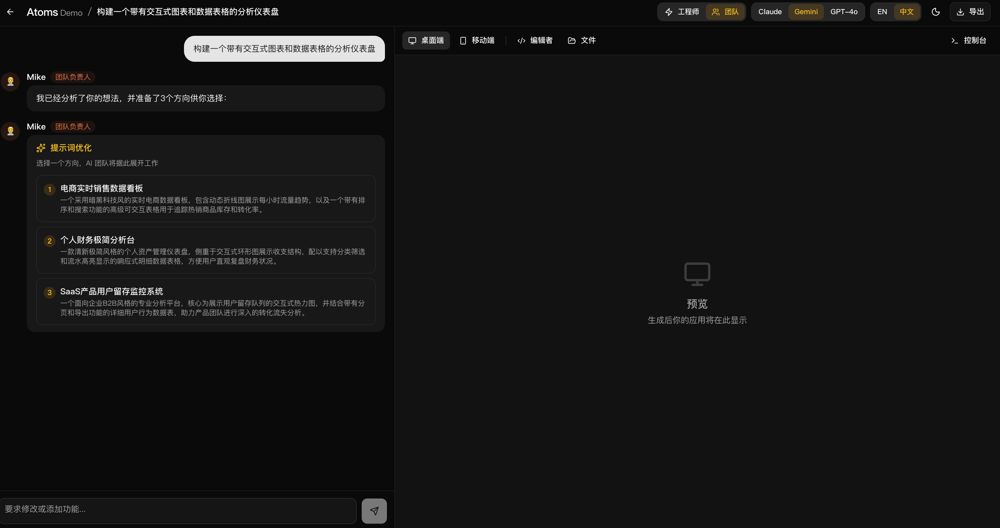
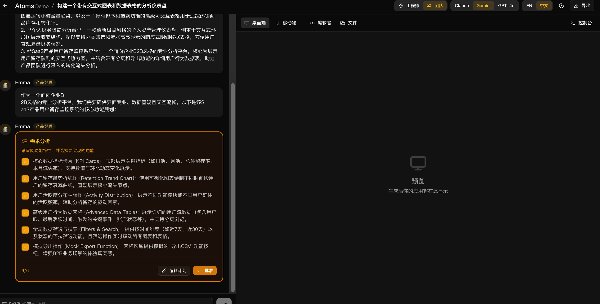
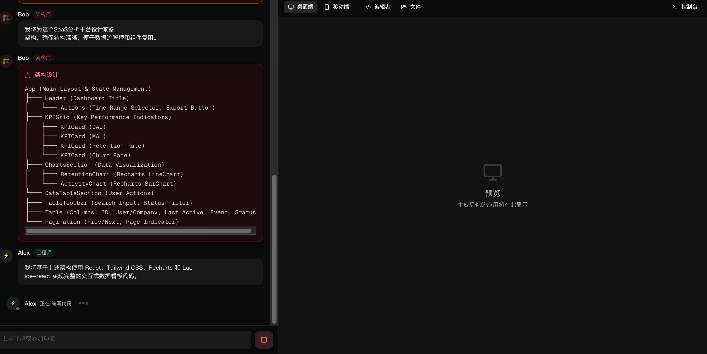
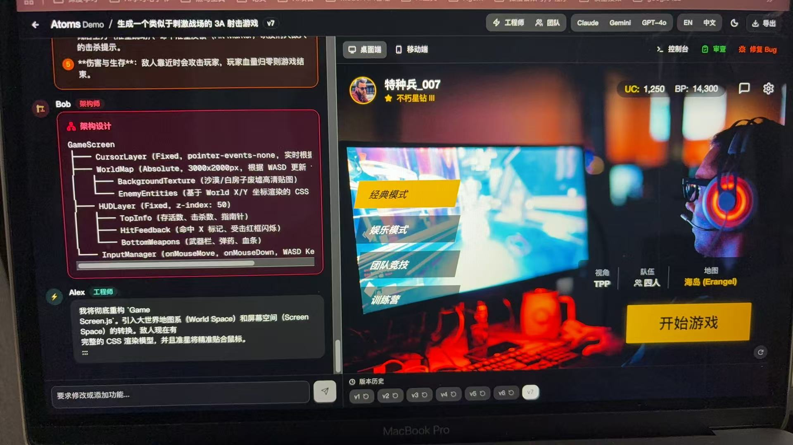
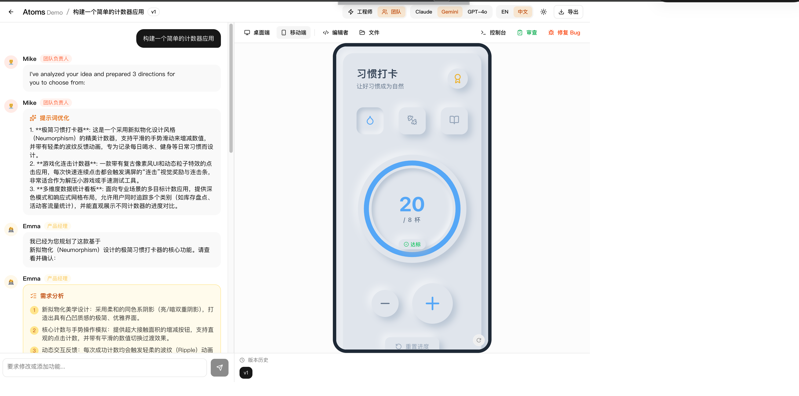
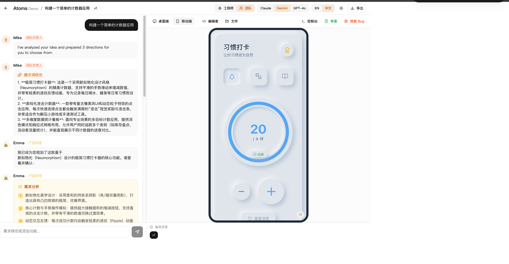
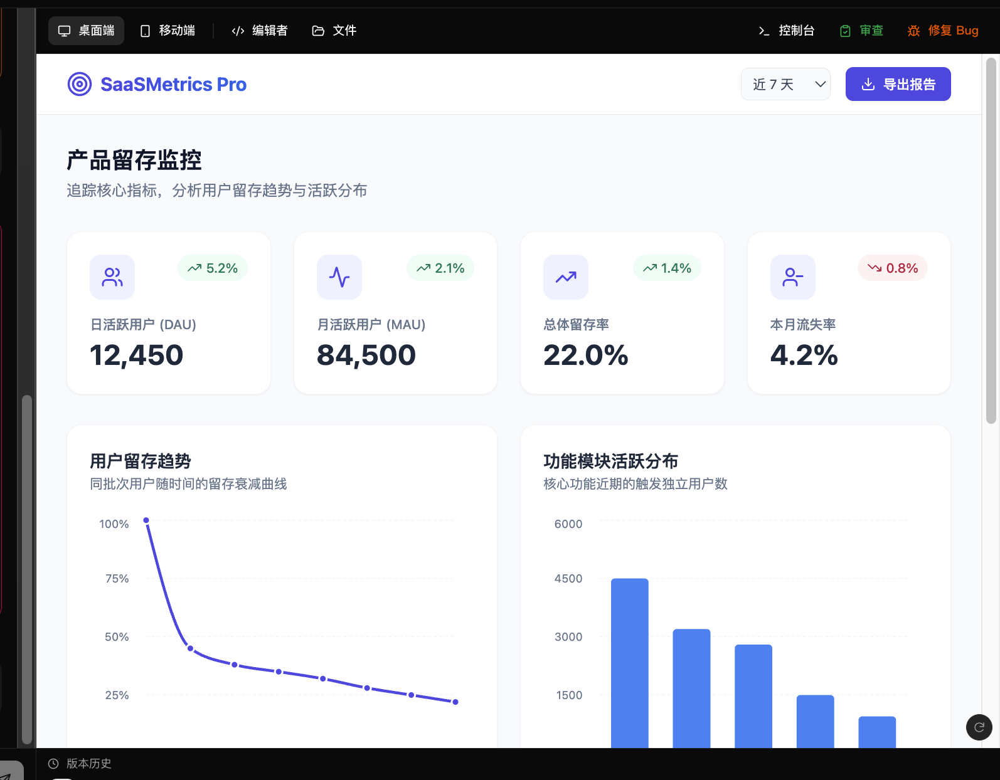
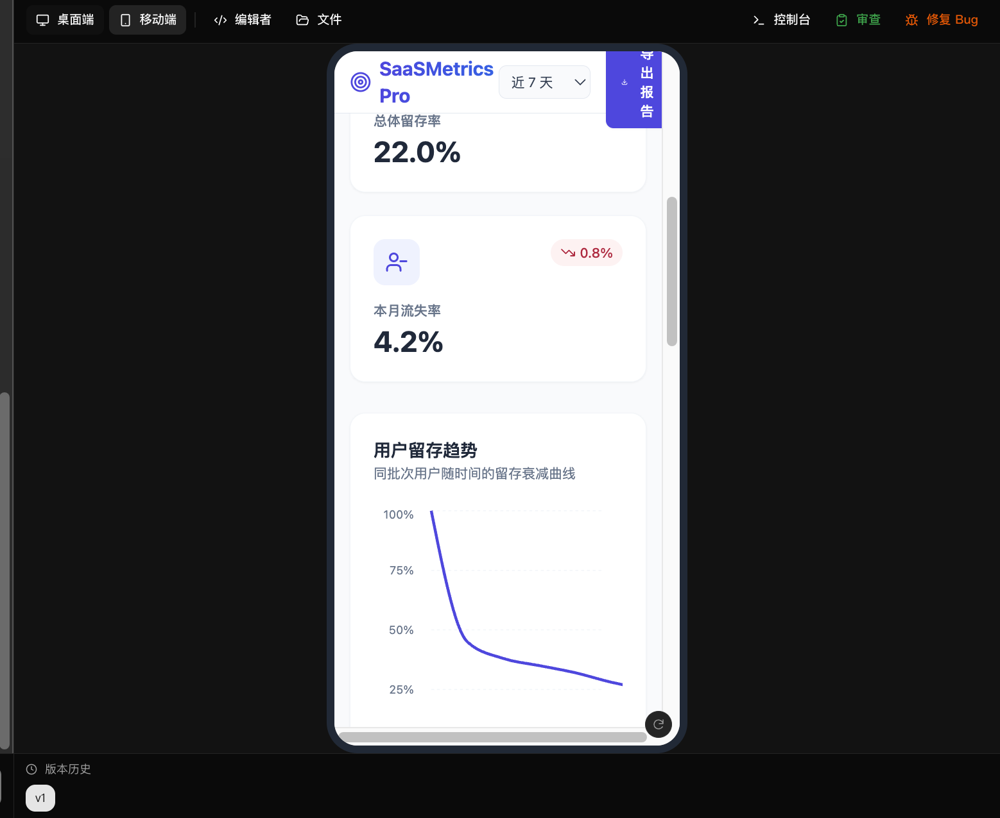
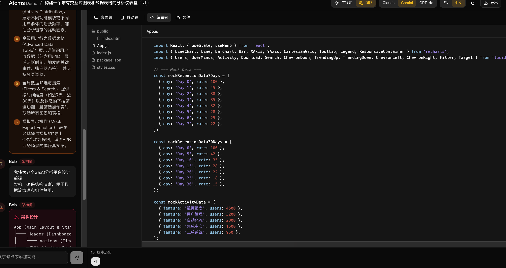
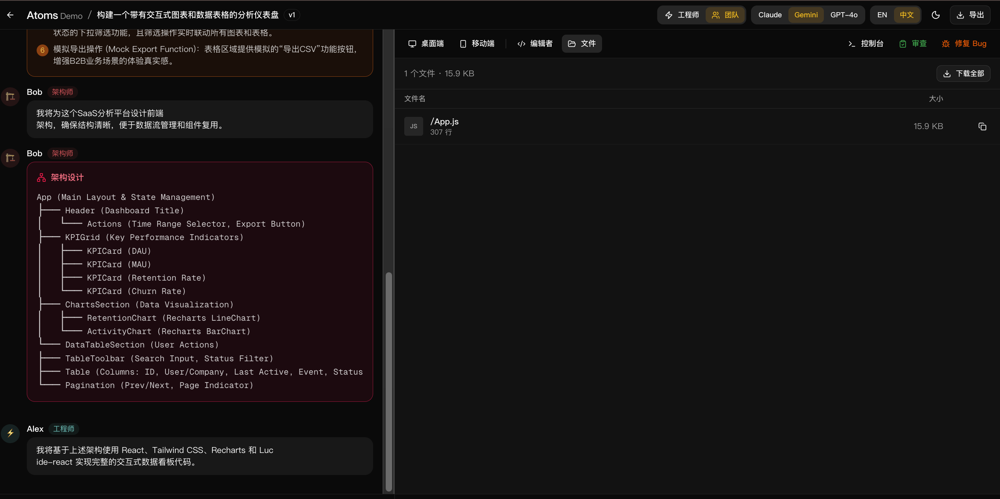

# Atoms Demo

> Multi-AI Agent collaborative code generation platform, inspired by [Atoms.dev](https://atoms.dev)

Users describe what they want in natural language. A team of AI agents collaborates to analyze requirements, design architecture, and generate a fully runnable React application with live preview.

**Author**: Tianyi

## Demo

### 三阶段智能体协作流程

**Step 1 — Mike 提示词优化**：用户输入需求后，Mike 分析并提供 3 个优化方案供选择



**Step 2 — Emma 需求分析 + 用户审批**：Emma 拆解功能需求，用户通过 checkbox 选择要实现的功能



**Step 3 — Bob 架构设计 + Alex 编写代码**：Bob 输出组件架构树，Alex 基于架构编写完整代码



### 生成结果预览



<table>
  <tr>
    <td width="50%"><strong>习惯打卡器（亮色模式）</strong><br></td>
    <td width="50%"><strong>习惯打卡器（暗色模式）</strong><br></td>
  </tr>
  <tr>
    <td width="60%"><strong>SaaS 数据看板（桌面端）</strong><br></td>
    <td width="40%"><strong>SaaS 数据看板（移动端）</strong><br></td>
  </tr>
</table>

### 代码查看

<table>
  <tr>
    <td width="50%"><strong>代码编辑器</strong><br></td>
    <td width="50%"><strong>文件管理</strong><br></td>
  </tr>
</table>

---

## 实现思路与关键取舍

### 核心思路

本项目以 Atoms 产品为参考，实现了一个**多智能体协作代码生成平台**。核心架构决策：

1. **单次 LLM 调用模拟多智能体** — 不使用多次 API 调用，而是通过 System Prompt 让 LLM 在一次响应中扮演多个角色（Mike/Emma/Bob/Alex），用 `[AGENT]` 标记区分。流式解析器实时拆分为不同智能体的消息卡片。这比多次调用更一致、更快、更省 token。

2. **三阶段生成 + 用户审批** — 参考 Atoms 的交互流程，将代码生成拆为三个阶段：
   - **Phase 0（优化）**: Mike 分析用户 prompt，提供 3 个优化方案供选择
   - **Phase 1（计划）**: Emma 输出需求列表 → 暂停等待用户审批
   - **Phase 2（实现）**: 用户勾选/取消功能 → 点击"批准" → Bob 设计架构 + Alex 编写代码

   这让用户对生成内容有控制权，避免浪费 token 生成不需要的功能。

   代码生成后，**QA 智能体**自动监听 Sandpack 运行时错误（console.error + 编译错误），检测到问题后自动触发修复，最多尝试 3 次。无错误时静默通过，用户无感知。

3. **Sandpack 浏览器内运行** — 使用 CodeSandbox 的 Sandpack 作为预览引擎，生成的 React 代码在浏览器内直接运行，无需后端编译。通过 Tailwind CDN + 预设依赖（recharts、lucide-react、date-fns）覆盖大部分常见场景。

4. **自建认证而非第三方** — 使用 bcryptjs + JWT + httpOnly Cookie 实现完整认证流程，而非依赖 Supabase Auth 或 NextAuth。这减少了外部依赖，部署更简单。

### 关键取舍

| 取舍 | 选择 | 原因 |
|------|------|------|
| 智能体模拟方式 | 单次 LLM + 标记解析 | 多次调用延迟高、成本高、上下文不连贯 |
| 预览引擎 | Sandpack (浏览器内) | 无需后端编译、即时运行、支持热更新 |
| 数据库 | PostgreSQL + Prisma | 生产级持久化、Docker 一键启动 |
| 认证 | 自建 JWT | 减少外部依赖、部署简单 |
| 样式方案 | Tailwind CDN（生成代码中） | Sandpack 无法编译 PostCSS，CDN 是最可靠方案 |
| 代码编辑 | 只读查看（非可编辑） | 用户通过对话修改代码，编辑器仅用于查看 |
| 流式解析 | 自定义 stream-parser | 需要实时拆分 `[AGENT]` 和 `:::block:::` 标记 |

---

## 功能清单

### 核心功能

- **多智能体团队协作** — Mike（提示词优化）、Emma（需求分析）、Bob（架构设计）、Alex（代码实现）、QA（自动测试修复）5个智能体分工协作
- **提示词优化** — Mike 分析用户输入，提供 3 个不同方向的优化方案供选择
- **用户审批流程** — Emma 输出需求列表后暂停，用户通过 checkbox 勾选要实现的功能，点击"批准"后继续
- **实时代码预览** — 生成的 React 应用在 Sandpack 中即时运行，支持完整交互
- **对话式迭代修改** — 通过对话修改已有代码："把按钮改成红色"自动生成差量更新
- **多模型切换** — 支持 Claude、Gemini、GPT-4o，对话中随时切换

### 延展功能

- **AI 代码审查** — 对生成的代码进行质量/性能/可访问性/安全性评分，给出改进建议
- **代码编辑器视图** — 使用 Sandpack 内置编辑器，左侧文件树 + 右侧语法高亮代码
- **文件管理视图** — 文件列表，显示文件类型、大小、行数，支持复制和批量下载
- **版本历史与回滚** — 每次生成创建版本快照，点击回滚
- **Bug 修复** — 一键将当前代码发送给 AI 修复
- **QA 自动测试** — 代码生成后自动检测 Sandpack 运行时错误，触发 AI 自动修复（最多 3 次）
- **工程师/团队模式** — 单人模式（Alex 直接写代码）或团队协作模式
- **桌面端/移动端预览** — 切换桌面全宽和 iPhone 框架预览
- **控制台** — 查看 Sandpack 运行时的 console 输出
- **代码导出** — 下载生成的应用为 zip 包
- **双语支持** — 中英文 UI 切换，智能体根据用户语言响应
- **暗色模式** — 系统感知 + 手动切换

### 基础设施

- **用户认证** — 注册/登录/登出，bcryptjs 密码哈希 + JWT httpOnly Cookie
- **路由保护** — Middleware 拦截未登录用户，重定向到登录页
- **数据持久化** — PostgreSQL 存储用户、项目、对话消息、代码版本
- **API 安全** — 所有端点验证用户身份 + 项目归属
- **Docker 容器化** — docker-compose 一键启动（PostgreSQL + App）

---

## 架构

```
┌───────────────────────────────────────────────────────────────┐
│                        Next.js 16 App                         │
├──────────────────────┬────────────────────────────────────────┤
│   Chat Panel (40%)   │         Preview Panel (60%)             │
│                      │                                         │
│  User Message        │  ┌─── View Tabs ───────────────────┐   │
│  ┌────────────────┐  │  │ Desktop│Mobile│Editor│Files      │   │
│  │ 🎯 Mike: 协调   │  │  ├────────────────────────────────┤   │
│  ├────────────────┤  │  │                                  │   │
│  │ 📋 Emma: 需求   │  │  │  Sandpack Live Preview          │   │
│  │ ☑ Feature 1    │  │  │  (React + Tailwind CDN)          │   │
│  │ ☑ Feature 2    │  │  │                                  │   │
│  │ [编辑] [批准]   │  │  │  or Code Editor (read-only)     │   │
│  ├────────────────┤  │  │  or Files List                   │   │
│  │ 🏗️ Bob: 架构    │  │  │                                  │   │
│  ├────────────────┤  │  ├──────────────────────────────────┤   │
│  │ ⚡ Alex: 代码   │  │  │  Console │ Review │ Fix Bug      │   │
│  ├────────────────┤  │  ├──────────────────────────────────┤   │
│  │ 🧪 QA: 自动测试 │  │  │  (QA auto-detects runtime errors │   │
│  └────────────────┘  │  │   and triggers auto-fix ×3)      │   │
│                      │  ├──────────────────────────────────┤   │
│  ┌────────────────┐  │  │  Version History (v1 v2 v3...)   │   │
│  │  Chat Input     │  │  └──────────────────────────────────┘   │
│  └────────────────┘  │                                         │
├──────────────────────┴────────────────────────────────────────┤
│                    API Layer (Edge Runtime)                     │
│  /api/chat (SSE) │ /api/review │ /api/projects CRUD           │
│  /api/auth (JWT) │ Middleware (route protection)               │
├───────────────────────────────────────────────────────────────┤
│           Model Router → Claude / Gemini / OpenAI              │
├───────────────────────────────────────────────────────────────┤
│     PostgreSQL (users, projects, chat_messages, code_versions) │
└───────────────────────────────────────────────────────────────┘
```

### 多智能体流式协议

一次 LLM 调用生成结构化输出，前端流式解析器实时拆分：

```
[MIKE] 我来协调这个任务...          → 🎯 Mike 消息卡片
[EMMA]                              → 📋 Emma 消息卡片
:::feature_list                     → 需求列表（可交互 checkbox）
1. 用户登录注册
2. 数据可视化图表
:::
[BOB]                               → 🏗️ Bob 消息卡片
:::architecture                     → 架构树形图
App ├── Header ├── Dashboard └── Footer
:::
[ALEX]                              → ⚡ Alex 消息卡片
:::files                            → 代码文件（更新 Sandpack 预览）
{"/App.js": "import React...", "/styles.css": "..."}
:::
```

### 三阶段生成流程

```
用户输入 prompt
    ↓
Phase 0: POST /api/chat { phase: 'optimize' }
    ↓
Mike: :::prompt_options (3 个优化方案) → 暂停
    ↓
用户选择方案
    ↓
Phase 1: POST /api/chat { phase: 'plan' }
    ↓
Emma: :::feature_list → 暂停
    ↓
用户审阅功能列表 (checkbox + 批准按钮)
    ↓
Phase 2: POST /api/chat { phase: 'implement', approvedFeatures }
    ↓
Bob: :::architecture → Alex: :::files → 预览更新
    ↓
QA: 自动检测 Sandpack 运行时错误 → 有错误则触发 Alex 自动修复（最多 3 次）
```

---

## 技术栈

| 层级 | 技术 | 版本 |
|------|------|------|
| 框架 | Next.js (App Router) | 16.2 |
| 语言 | TypeScript | 5.x |
| UI | Tailwind CSS + shadcn/ui | v4 |
| 状态管理 | Zustand | 5.0 |
| 预览引擎 | Sandpack (CodeSandbox) | 2.20 |
| AI 模型 | Claude / OpenAI / Gemini | 多模型 |
| 流式传输 | Server-Sent Events (Edge Runtime) | - |
| 数据库 | PostgreSQL + Prisma ORM | 16 / 6.19 |
| 认证 | bcryptjs + jose (JWT) | 自建 |
| 容器化 | Docker + docker-compose | Multi-stage |
| 主题 | next-themes | 暗色/亮色 |
| 国际化 | 自建 i18n (Zustand + localStorage) | 中/英 |

---

## 快速开始

### Docker 部署（推荐）

```bash
# 1. 克隆仓库
git clone https://github.com/BuddhaYi/atoms-demo.git
cd atoms-demo

# 2. 配置环境变量
cp .env.example .env.local
# 编辑 .env.local，至少配置一个 AI 模型的 API Key

# 3. 一键启动（PostgreSQL + App）
make start

# 4. 访问
open http://localhost:3000
```

### 本地开发

```bash
# 安装依赖
npm install

# 配置环境变量
cp .env.example .env.local

# 启动开发服务器
npm run dev
```

### 环境变量

| 变量 | 必填 | 说明 |
|------|------|------|
| `GEMINI_API_KEY` | 至少一个* | Gemini API Key |
| `GEMINI_BASE_URL` | 否 | 网关地址（默认: grsai.dakka.com.cn） |
| `GEMINI_MODEL` | 否 | 模型名称（默认: gemini-3.1-pro） |
| `ANTHROPIC_API_KEY` | 至少一个* | Claude API Key |
| `OPENAI_API_KEY` | 至少一个* | OpenAI API Key |
| `JWT_SECRET` | 否 | JWT 签名密钥（生产环境必须设置） |
| `DATABASE_URL` | 否 | PostgreSQL 连接串（Docker 中自动配置） |

\* 三个 AI 模型至少配置一个

---

## 项目结构

```
src/
├── app/
│   ├── page.tsx                        # 首页（Prompt 输入 + 分类卡片）
│   ├── dashboard/page.tsx              # 项目列表
│   ├── workspace/[projectId]/page.tsx  # 主工作区
│   ├── login/page.tsx                  # 登录页
│   ├── register/page.tsx               # 注册页
│   └── api/
│       ├── auth/                       # 认证端点 (login/register/logout/me)
│       ├── chat/route.ts               # SSE 流式聊天（Edge Runtime）
│       ├── review/route.ts             # AI 代码审查（Edge Runtime）
│       └── projects/                   # 项目 CRUD + 消息 + 版本
├── components/workspace/
│   ├── ChatPanel.tsx                   # 消息列表 + 思考指示器
│   ├── ChatMessage.tsx                 # 消息渲染（文本/需求/架构/代码）
│   ├── FeatureListCard.tsx             # 需求卡片（支持 checkbox 审批）
│   ├── ArchitectureCard.tsx            # 架构树形图卡片
│   ├── PreviewPanel.tsx                # 预览面板 + 工具栏（4个视图）
│   ├── SandpackPreview.tsx             # Sandpack 预览 + 控制台
│   ├── SandpackErrorListener.tsx      # 运行时错误监听（QA 用）
│   ├── CodeEditorPanel.tsx             # 代码编辑器视图
│   ├── FilesPanel.tsx                  # 文件列表视图
│   ├── ReviewPanel.tsx                 # AI 审查报告面板
│   ├── VersionHistory.tsx              # 版本历史 + 回滚
│   ├── AgentIndicator.tsx              # 智能体活动指示器
│   └── TopBar.tsx                      # 模式/模型/语言切换
├── lib/
│   ├── auth.ts                         # JWT + bcryptjs 认证工具
│   ├── prisma.ts                       # Prisma Client 单例
│   ├── ai/
│   │   ├── model-router.ts            # 多模型路由（Claude/Gemini/OpenAI）
│   │   └── prompts/system.ts          # 系统提示词（计划/实现/审查/修复）
│   └── agents/
│       ├── registry.ts                # 智能体定义（名称/颜色/角色）
│       └── stream-parser.ts           # [AGENT] + :::block::: 流式解析器
├── hooks/
│   ├── useChat.ts                      # SSE 消费 + 两阶段流程 + 审批
│   ├── useQA.ts                        # QA 自动测试 + 错误修复编排
│   ├── useAuth.ts                      # 认证状态管理
│   └── useTranslation.ts              # 国际化 Hook
├── store/
│   ├── workspace-store.ts             # 工作区状态（Zustand）
│   └── language-store.ts             # 语言偏好
├── i18n/translations/                  # 中英文翻译（180+ key）
├── middleware.ts                       # 路由保护
└── types/index.ts                      # TypeScript 类型定义

prisma/
├── schema.prisma                       # 数据库模型（4张表）
├── migrations/                         # SQL 迁移
└── migrate.mjs                         # 迁移运行脚本

Docker files:
├── Dockerfile                          # Multi-stage 构建
├── docker-compose.yml                  # PostgreSQL + App
├── docker-entrypoint.sh               # 启动时自动迁移
└── Makefile                            # make start/stop/logs/clean
```

---

## 当前完成程度

### 已完成

- [x] 多智能体团队协作（Mike/Emma/Bob/Alex）
- [x] 三阶段生成（提示词优化 → 需求审批 → 架构+代码）
- [x] Sandpack 实时预览（桌面端/移动端）
- [x] 对话式迭代修改
- [x] 3 种 AI 模型切换（Claude/Gemini/GPT-4o）
- [x] 工程师/团队模式
- [x] AI 代码审查（质量/性能/可访问性/安全性评分）
- [x] 代码编辑器视图（文件树 + 语法高亮）
- [x] 文件管理视图（大小/行数/复制/下载）
- [x] 版本历史 + 回滚
- [x] Bug 修复功能
- [x] QA 自动测试（运行时错误检测 + AI 自动修复，最多 3 次）
- [x] 控制台（Sandpack console 输出）
- [x] 代码导出（zip 下载）
- [x] 用户注册/登录/登出（自建 JWT 认证）
- [x] 路由保护（Middleware）
- [x] API 安全（用户身份 + 项目归属校验）
- [x] PostgreSQL 数据持久化（用户/项目/消息/版本）
- [x] Docker 容器化（一键启动）
- [x] 中英文双语 UI（180+ 翻译 key）
- [x] 暗色/亮色主题
- [x] 响应式布局
- [x] 首页分类快捷入口（7 个分类）
- [x] 流式实时显示（即时输出，无延迟等待）
- [x] AI 思考指示器

### 未完成

- [ ] 线上部署（在线访问链接）
- [ ] Race Mode（双模型对比生成）
- [ ] @mention 智能体选择器
- [ ] Token 用量追踪与限制
- [x] Prompt 增强（Mike 提示词优化，提供 3 个方案供选择）
- [ ] AI 自动命名项目
- [ ] 页面过渡动画
- [ ] E2E 测试

---

## 如果继续投入时间的扩展计划

### P0（1-2 天）
- **线上部署** — 部署到 Railway/Render，获取在线访问链接
- **E2E 测试** — Playwright 覆盖核心流程（注册→创建→生成→预览→回滚）
- **错误边界** — React Error Boundary 防止白屏

### P1（3-5 天）
- **Race Mode** — 同时调用两个模型生成，用户选择更好的结果
- **Token 用量追踪** — 按用户/项目统计 token 消耗，设置限额

### P2（1-2 周）
- **协作编辑** — 支持在编辑器视图中直接修改代码（非只读）
- **模板市场** — 预设模板（Dashboard、Landing Page、E-commerce 等）
- **项目分享** — 生成公开链接分享项目
- **Webhook** — 生成完成后通知（Slack/邮件）
- **多框架支持** — 除 React 外支持 Vue、Svelte

---

## 数据库 ER 图

```
┌──────────┐       ┌──────────────┐
│  users   │──1:N──│   projects   │
│──────────│       │──────────────│
│ id       │       │ id           │
│ email    │       │ userId    (FK)│
│ password │       │ title        │
│ display  │       │ description  │
│ created  │       │ category     │
└──────────┘       │ status       │
                   │ created/upd  │
                   └──────┬───────┘
                     1:N  │  1:N
              ┌───────────┴───────────┐
              │                       │
     ┌────────────────┐     ┌─────────────────┐
     │ chat_messages  │     │  code_versions   │
     │────────────────│     │─────────────────│
     │ id             │     │ id              │
     │ projectId  (FK)│     │ projectId   (FK)│
     │ role           │     │ versionNumber   │
     │ agentName      │     │ files (JSON)    │
     │ content        │     │ prompt          │
     │ contentType    │     │ agentName       │
     │ metadata (JSON)│     │ modelUsed       │
     │ created        │     │ tokensUsed      │
     └────────────────┘     │ created         │
                            └─────────────────┘
```

---

## License

MIT
